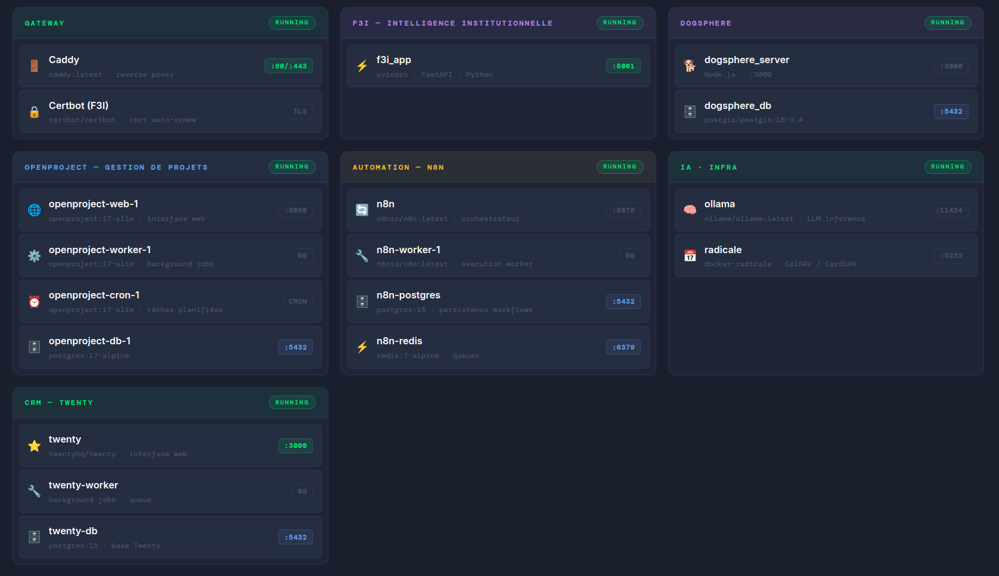

  

 

Business Enabler · Homelab Tinkerer Based in France · Active across Europe

 

&nbsp;
&nbsp;

&nbsp;
&nbsp;
&nbsp;

---

<table>
<tr>
<td valign="top" width="50%" align="center">

**Business Enabler**

I build [KairosTech](https://kairostech.fr) to be the structural backbone that lets tech founders focus on what they do best: innovate.

</td>
<td valign="top" width="50%" align="center">

**Spare-time Builder**

I use GitHub to collaborate with developers, track product innovations, and share configs from my homelab. The self-hosting rabbit hole runs deep.

</td>
</tr>
</table>

---

##  &nbsp;·&nbsp; [kairostech.fr](https://kairostech.fr)

> *The backbone behind your innovation.*

I work with tech startups and deep tech SMEs to build the systems that transform R&D into market traction — commercial architecture, operations & delivery, and institutional strategy.

 

<table>
<tr>
<td valign="top" width="33%" align="center">

**Go-to-Market**

Structure offer and sales, launch the pipeline, hire the first commercial profiles.

</td>
<td valign="top" width="33%" align="center">

**Operations**

Organise and deliver operations, strategic projects and customer support with rigour, tooling and method.

</td>
<td valign="top" width="33%" align="center">

**F3I**

Non-dilutive funding, institutional monitoring, and influence networks, optimised through AI.

</td>
</tr>
</table>

###  · Funding & Institutional Intelligence

> *European public R&D funding exists. Finding it across 27 countries and hundreds of sources is the real problem.*

F3I is a platform built to solve this systematically: it monitors official European and national public sources continuously and surfaces only the opportunities that match an organisation's actual profile and research topic.

- **AI-powered monitoring** across 12 countries + EU programs — BPIFrance, Horizon Europe, EIC, German / Italian / Spanish / Polish national agencies *(15 more coming soon)*
- **Proximity scoring** — each call ranked against a custom profile (sector, maturity stage, geography, strategic priorities)
- **Collaborative pipeline** — filterable dashboard with weekly automated digests and shareable read-only access

Sectors covered: <kbd>software</kbd> <kbd>startup</kbd> <kbd>SME</kbd> <kbd>deeptech</kbd> <kbd>semiconductors</kbd> <kbd>health</kbd> <kbd>defense</kbd> <kbd>energy</kbd> <kbd>digital</kbd> <kbd>quantum</kbd>

→ **[Live demo dashboard](https://f3i.kairostech.fr/share/UXVe89tk1wSNiLZhjFaGu0vji2R43kRtY1ONthSRHAA)**&nbsp;&nbsp;|&nbsp;&nbsp;**[Request a demo](mailto:contact@kairostech.fr)**

*Source code is private for now... while interest is confirmed.*

---

## Personal : Self-hosting &nbsp;·&nbsp; Homelab & Home Automation

Started with a handful of useful self-hosted services. Now on a mission to bring both [KairosTech](https://kairostech.fr) and my personal life as much under my own control as possible.

**Current stack** *(updated April 2026)*

  

